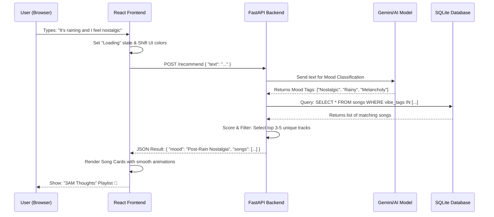

# Data Flow Architecture: Mood-Based Music Recommender

This document tracks the journey of a "Vibe Request" from the moment a user types a mood to the moment they receive their curated playlist.

## 🔄 The Data Lifecycle

## 1. Frontend Interaction (The Spark)
*   **Capture**: The user enters a sentence or clicks a moon icon.
*   **Anticipation**: The UI immediately transitions. If the user types "Gym", the background pulses with energy before the result even returns.
*   **Request**: A Fetch/Axios call sends the raw string to the `/recommend` endpoint.

## 2. Backend Orchestration (The Processing)
*   **Reception**: FastAPI validates the request body.
*   **AI Interpretation**: 
    *   The backend sends the prompt to the AI (Gemini).
    *   The AI doesn't just guess; it categorizes the input into *High/Low Energy*, *Valence (Positivity)*, and specific *Genre Vibe*.
    *   Example: "Coding late" -> `[Lo-fi, Focus, Night]`.

## 3. The Data Retrieval (The Discovery)
*   **Query**: The backend translates AI tags into a SQL query. 
*   **Fuzzy Matching**: If no exact match is found for "Post-Rain", it falls back to "Melancholy" or "Calm".
*   **Randomization**: To keep things fresh, the system picks a random subset of matching songs.

## 4. The Delivery (The Result)
*   **Enrichment**: The backend generates a creative playlist name (e.g., "Main Character Energy") based on the detected mood.
*   **JSON Response**: Returns a clean object containing:
    *   Detected Mood Label.
    *   Playlist Title.
    *   Song Array (Title, Artist, Album Art, Link).

## 5. UI Rendering (The Reveal)
*   **Transformation**: The frontend receives the data and triggers a "Reveal" animation.
*   **Interaction**: The user can now preview songs or click to open them in Spotify/YouTube.
